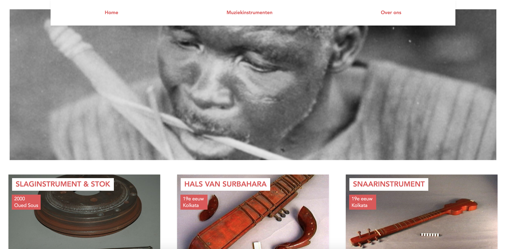

# Muziekinstrumenten door de jaren heen

## Het concept
Een website met oude muziekinstrumenten van over de hele wereld bedoeld voor echt muziekliefhebbers of mensen die geïnteresseerd zijn in kunstgeschiedenis. 



## Beschrijving
Ik ga een webapp maken met oude muziekinstrumenten van over de hele wereld, hiervan zie je een titel, uit welk jaar het komt, waar het vandaan komt en een foto. Je kunt de instrumenten zien per cultuurgebied en gesorteerd op tijd, zo kun je als het ware ‘door de tijd heen klikken’. Naast de instrumenten bekijken en filteren kun je ook nog horen wat voor geluid het instrument maakt. De webapp is gemaakt aan de hand van data van de collectie wereldculturen en met het framework Vue. 

## Installatie Vue

Met deze opdracht heb ik gebruik gemaakt van het framework Vue, de installatie hiervan heb ik gedaan aan de hand van [deze link](https://medium.com/js-dojo/getting-started-with-vuejs-for-web-and-native-285dc64f0f0d). 

Wanneer je node hebt, kun je Vue-Cli downloaden met 

```bash
npm install -g @vue/cli
```

Na de installatie herstart je de terminal en check je of vue-cli werkt met

```bash
vue –version
```

Wanneer deze installatie gelukt is kun je dit project installeren door het volgende in je terminal in te voeren

```bash
git clone https://github.com/kimgarrard/frontend-applications.git
```

Mocht je dit project niet via de terminal willen clonen kan je dit ook clonen door naar mijn repository 'frontend-applications' te gaan en dan op de groene knop met 'clone or download' te klikken. 

## Data

De data die ik heb gebruikt komt van https://collectie.wereldculturen.nl/. Dit is een verzameling van allerlei objecten over de hele wereld van vroeger. Deze data is enorm breed en kan variëren van maskers uit Afrika tot foto's van dansende mensen in Azië. Om de data op te halen gebruik ik SPARQL, dit is mijn code:

```bash
PREFIX xsd: <http://www.w3.org/2001/XMLSchema#>
PREFIX rdf: <http://www.w3.org/1999/02/22-rdf-syntax-ns#>
PREFIX dc: <http://purl.org/dc/elements/1.1/>
PREFIX dct: <http://purl.org/dc/terms/>
PREFIX skos: <http://www.w3.org/2004/02/skos/core#>
PREFIX edm: <http://www.europeana.eu/schemas/edm/>
PREFIX foaf: <http://xmlns.com/foaf/0.1/>

SELECT ?cho ?title ?typeLabel ?img ?year ?placeName WHERE {

  <https://hdl.handle.net/20.500.11840/termmaster1248> skos:narrower* ?type .
  ?type skos:prefLabel ?typeLabel .
  ?place skos:prefLabel ?placeName .

  ?cho edm:object ?type .
  ?cho dc:title ?title .
  ?cho edm:isShownBy ?img .
  ?cho dct:created ?year .
  ?cho dct:spatial ?place .
  
  FILTER langMatches(lang(?title), "ned")
  FILTER(xsd:integer(?year) >= 0 && xsd:integer(?year) <= 2000)
}
```

## Features

- [x] Muziekinstrumenten kunnen bekijken
- [x] Klikken op cultuurgebied en daarvan de instrumenten bekijken
- [ ] Muziekinstrumenten op volgorde van tijd gesorteerd
- [ ] Detailpagina van de instrumenten
- [ ] Geluid van de instrumenten kunnen horen

## Bronnen
* Database van NMVW - https://collectie.wereldculturen.nl/
* Installeren van Node en Homebrew - https://www.dyclassroom.com/howto-mac/how-to-install-nodejs-and-npm-on-mac-using-homebrew
* Installeren van Vue - https://medium.com/js-dojo/getting-started-with-vuejs-for-web-and-native-285dc64f0f0d
* Youtube tutorials Vue - https://www.youtube.com/playlist?list=PL55RiY5tL51p-YU-Uw90qQH419BM4Iz07

### Hulp van anderen
* Hele Vue team, iedereen helpt elkaar en geeft elkaar tips
* Kris, heeft mij erg geholpen met de data op mijn pagina weer te kunnen geven
* Manouk, met haar heb ik veel samen gewerkt

## Wat ik heb geleerd
* Werken met de terminal
* Werken met het framework Vue
* Basis van SPARQL
* SPARQL omzetten in json en op een pagina weergeven
